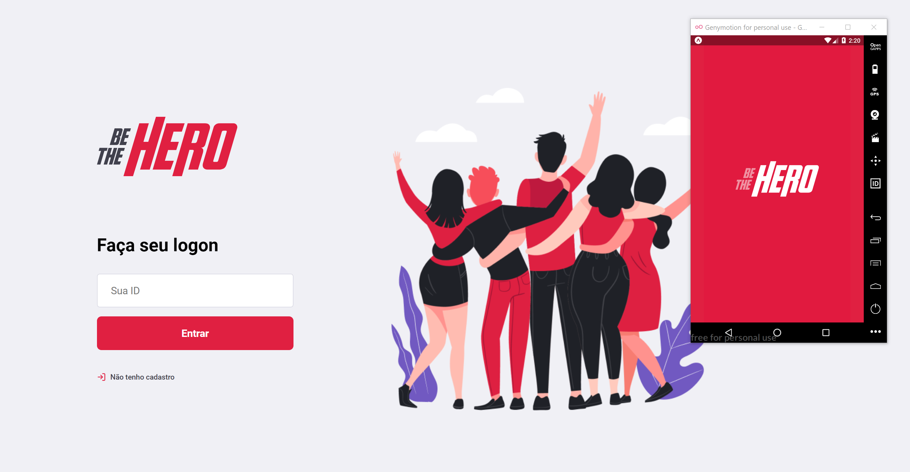

# omnistack11 - Be the Hero
A week-long event that you can build an application with javascript/Node.js( knex/SQLite ), ReactJS, and React Native, ...

@rocketseat
O Be The Hero é o projeto da semana OmniStack 11.0 da Rocket Seat, com o objetivo de construir um aplicativo para o contato de ONG's com doadores.

* React Native
* Expo
* ReactJS
* Node
* REST
* SQLite
* Migration
* Celebrate
* Axios
* Jest
* Eslint
* Prettier

